# 环境
- keras 和 Tensorflow：keras已成为tensorflow的官方api
  - 安装教程：https://www.tensorflow.org/install
- numpy： https://www.numpy.org.cn/
- pandas
- matplotlib

本次所使用的python解释器是 Python 3.6.8  
所有所需要的依赖已放在 requirements 文件中，执行`python -m pip install -r requirements`  

# 概念
- 张量：一般可认为是多维数组
  - 二维张量  
  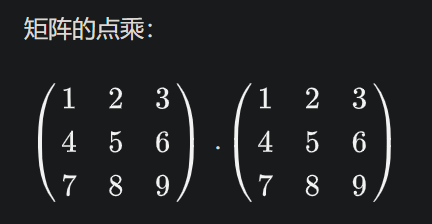
  - 张量的shape（形状）：通俗地指各个维度元素个数
- 模型
  - $z = wx + b$
- 优化器，用于更新权重向量
  - 用于确定权重空间，优化器需要使得损失函数最小化
  - 常用的优化器
    - 随机梯度下降（SGD, Stochastic Gradient Descent）
    - RMSprop
    - Adam
    - 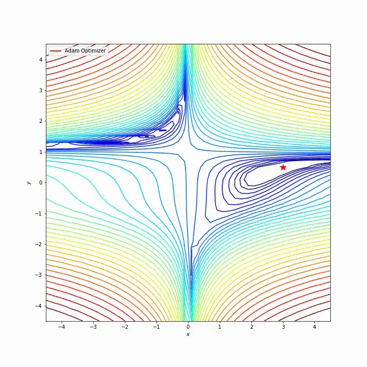
- 损失函数：衡量模型准确率
  - 均方误差（MSE）
  - 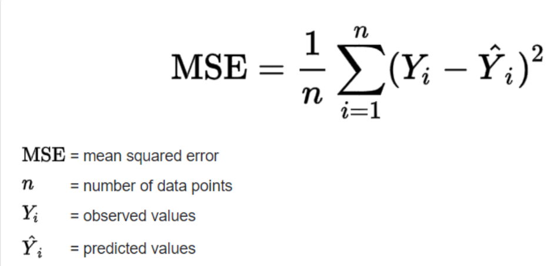
  - 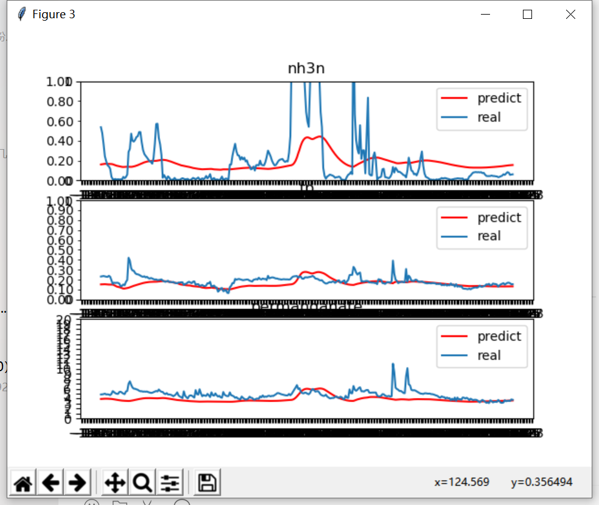
  - 二分对数损失（Binary cross-entropy）,适用于二元标签
  - 多分类对数损失（Categorical cross-entropy）
- 评价函数：类似于损失函数，只是不参与模型训练，只进行评估
- 激活函数：起非线性映射的作用，其可将神经元的输出幅度限制在一定范围内，一般限制在（-1~1）或（0~1）之间
  - Sigmoid
  - relu
  - tanh
  - 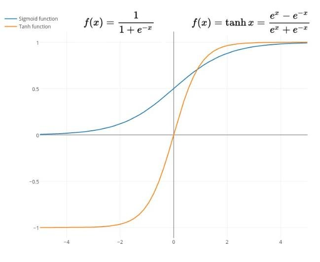
  - 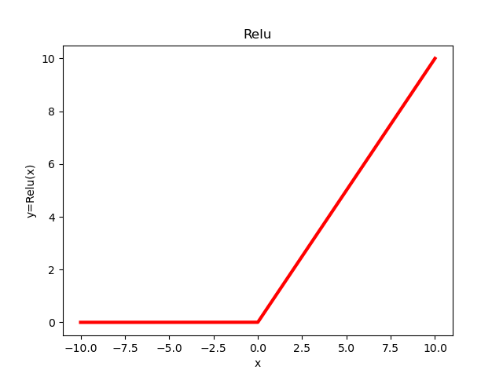

最基础的神经网络模型 —— 多层感知机：
- 还有其他类型的神经网络模型：
    - 卷积神经网络：适合图片识别  
    - 对抗神经网络：适合自主创作  
    - RNN循环神经网络：适合时间序列带有记忆类的问题  

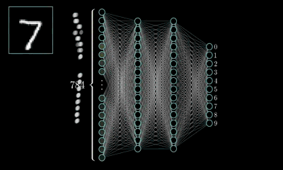

# 数据处理  
>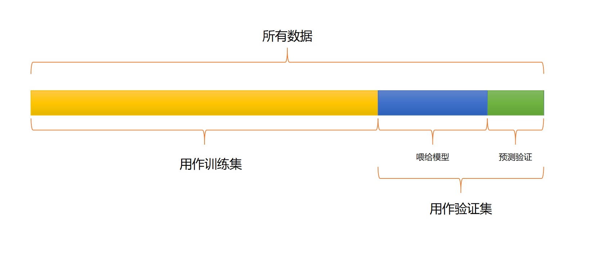
>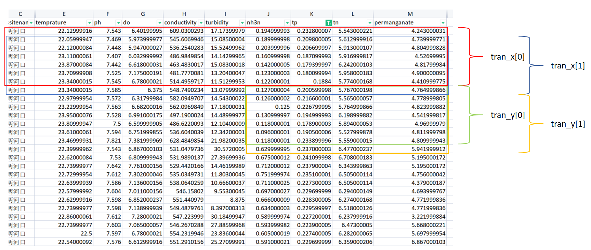

# 预测结果
- 使用前 15 行监测数据预测未来 5 行氨氮、总磷、高猛酸盐指数
  - 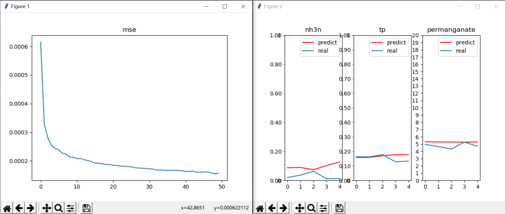
  - 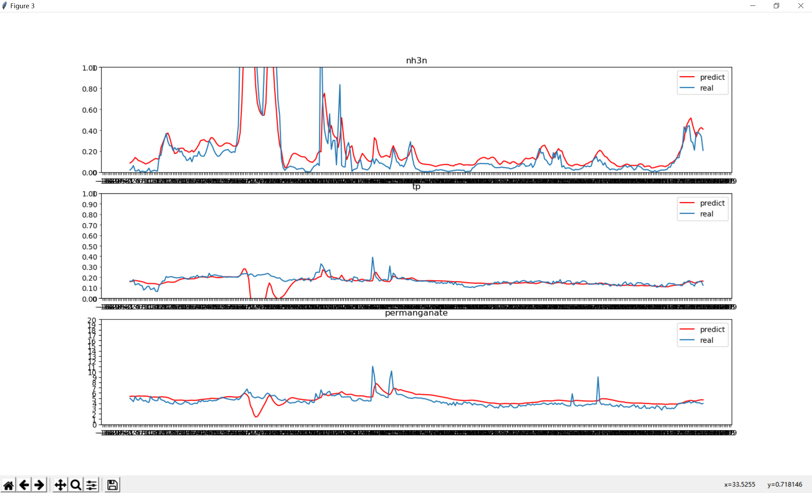
- 使用前 240 行监测数据预测未来 120 行氨氮、总磷、高猛酸盐指数
  - 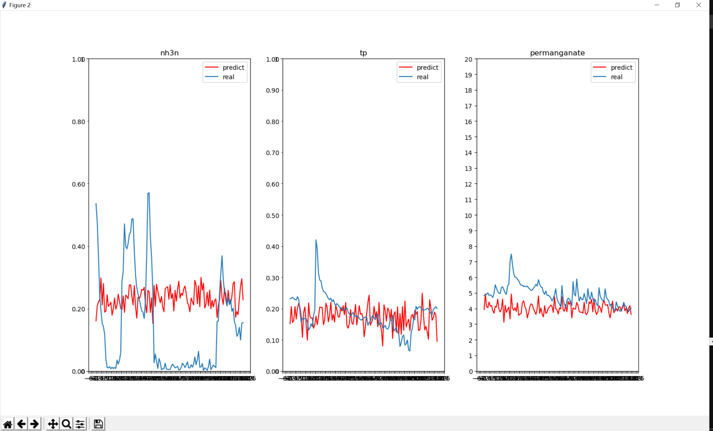
  - 

